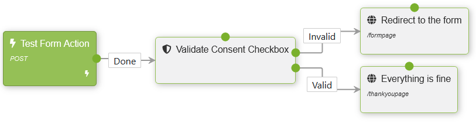

# Lombiq Privacy for Orchard Core

  

## About

Orchard module containing features related to data protection/privacy and the EU law on it, the [General Data Protection Regulation](https://eur-lex.europa.eu/legal-content/EN/TXT/?qid=1462439808430&uri=CELEX:32016R0679) (GDPR). Check out a demo video of this module [here](https://www.youtube.com/watch?v=GnyYL9Zdo8Q).

**Important!** Using this module will not make your site GDPR-compliant alone. Do not forget to create a privacy policy page that you need to link to from the various consent-asking features.

We at [Lombiq](https://lombiq.com/) also used this module for the new [Lombiq website](https://lombiq.com/) when migrating it from Orchard 1 to Orchard Core ([see case study](https://lombiq.com/blog/how-we-renewed-and-migrated-lombiq-com-from-orchard-1-to-orchard-core)).

This module is also available on all sites of [DotNest, the Orchard SaaS](https://dotnest.com/).

Do you want to quickly try out this project and see it in action? Check it out in our [Open-Source Orchard Core Extensions](https://github.com/Lombiq/Open-Source-Orchard-Core-Extensions) full Orchard Core solution and also see our other useful Orchard Core-related open-source projects!

**NOTE:** This module has an Orchard 1 version in the [dev-orchard-1 branch](https://github.com/Lombiq/Orchard-Privacy/tree/dev-orchard-1).

## Features

The module consists of the following independent features:

### Consent Banner Feature

Shows a banner where users can accept the privacy policy. **Note** that certain ad blockers can prevent the banner from showing up; e.g., [AdGuard AdBlocker for Chrome](https://chrome.google.com/webstore/detail/adguard-adblocker/bgnkhhnnamicmpeenaelnjfhikgbkllg) doesn't do this, but [I don't care about cookies](https://chrome.google.com/webstore/detail/i-dont-care-about-cookies/fihnjjcciajhdojfnbdddfaoknhalnja) (not too surprisingly) does.

If the user is unauthenticated, they can use the banner to accept or reject the privacy statement, their decision will be stored in a cookie by the browser.

If the user is authenticated, their only option is to accept the privacy policy via the banner. This is so because it is assumed that during registration they already accepted a suitable privacy policy, it's just that the Lombiq.Privacy module or something similar wasn't used at the time.

### Registration Consent Feature

Shows a privacy consent checkbox on the registration form that needs to be checked by the users to be able to register. After registration, the user's consent is stored in the `PrivacyConsent` section of the user's properties.

**NOTE:** If the user registered before this feature was enabled then they can accept the consent with the consent banner (if it's enabled). The consent will be stored in this case as well.

### Form Consent Feature

Adds a new Privacy Consent Checkbox widget content type that can be added to forms with the Forms module. In this case, users must accept the privacy policy before they can post content to the site. You can validate the consent with the `Validate Privacy Consent Checkbox` workflow activity in the following way:

## Dependencies

This module has the following dependencies:

- [Lombiq Helpful Libraries for Orchard Core](https://github.com/Lombiq/Helpful-Libraries)
- [Lombiq Node.js Extensions](https://gihub.com/Lombiq/NodeJs-Extensions)

## Contributing and support

Bug reports, feature requests, comments, questions, code contributions and love letters are warmly welcome. You can send them to us via GitHub issues and pull requests. Please adhere to our [open-source guidelines](https://lombiq.com/open-source-guidelines) while doing so.

This project is developed by [Lombiq Technologies](https://lombiq.com/). Commercial-grade support is available through Lombiq.
